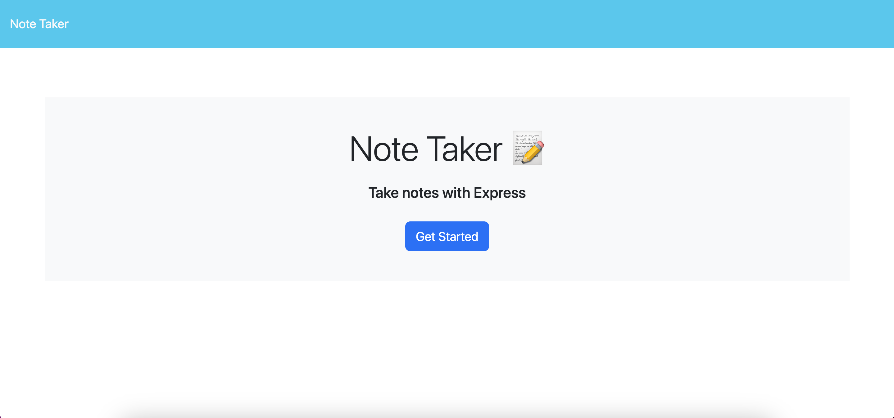

# Note Tracker

## Description

This is an app where you can track your notes. Every note you write will be inserted to a json file. In addition you can delete notes you no longer need.

## Installation

N/A

## Usage

In order to use this app, you need to type a note title and then the text. When you are done click on the save button, then refresh the page and your note will apear on the page. When you want to delete a note, click on the delete button, then refresh the page and the note you chose to delete will be gone. 

![URL] (https://fierce-brook-51996-731ce9af3bc4.herokuapp.com/)

## License

N/A
